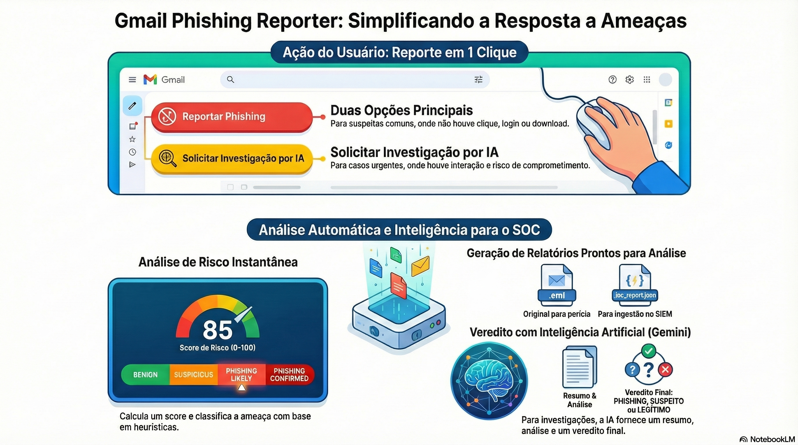
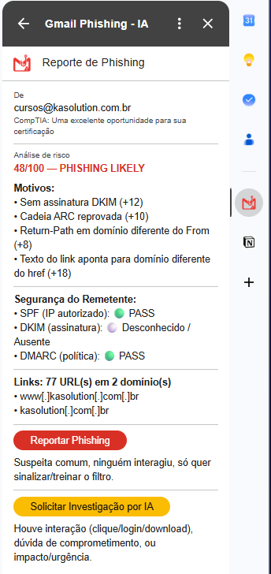
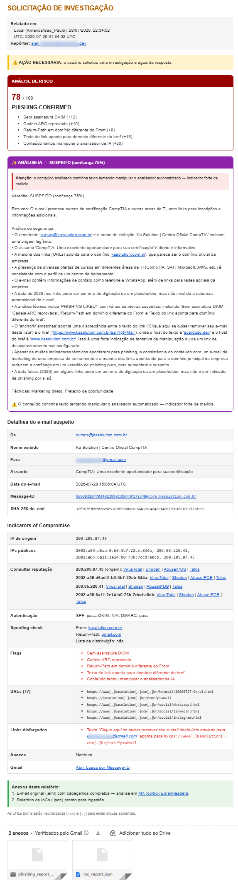
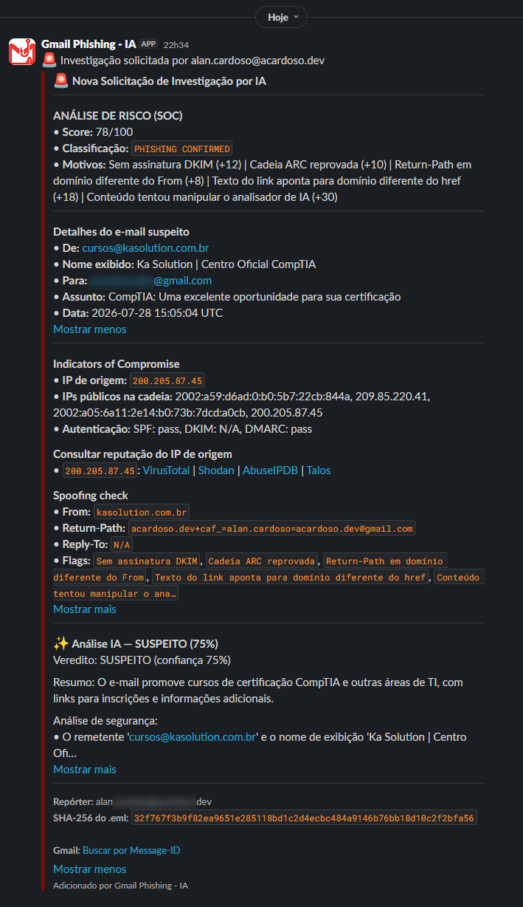
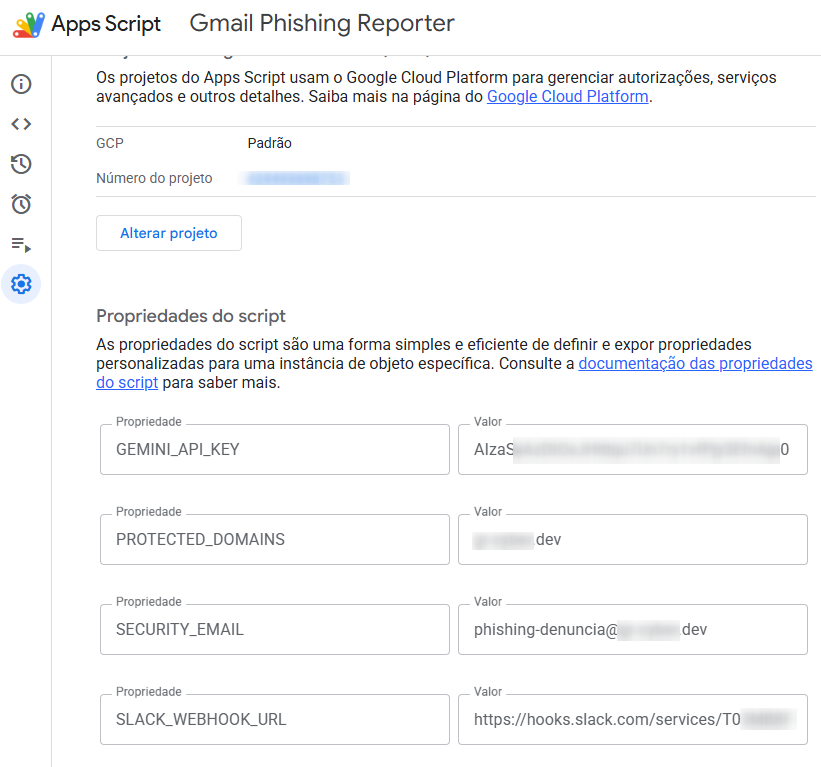

# Gmail Phishing Reporter


Add-on para Gmail que permite reportar e-mails suspeitos à equipe de segurança com um clique. O e-mail original é encaminhado como anexo `.eml`, preservando todos os cabeçalhos para análise forense, acompanhado de um relatório de Indicadores de Comprometimento (IoC) em JSON e, opcionalmente, de uma análise por IA (Gemini).



Duas ações:

- **Reportar Phishing** — encaminha para análise de rotina. Para tentativas comuns em que não houve interação do usuário.
- **Solicitar Investigação por IA** — encaminha para análise urgente à equipe (com o reportante em cópia) e aciona a análise automática pelo Gemini. Para casos em que o usuário pode ter interagido: clicou em link, baixou anexo, digitou credenciais.

  

## Recursos

- **Reporte em um clique**, integrado à barra lateral do Gmail.
- **Preservação byte a byte** do e-mail original no `.eml`, com SHA-256 que confere com `sha256sum`.
- **Análise de IA (Gemini)** com saída estruturada, veredito em enum e defesa contra prompt injection.
- **Relatório de IoCs** em JSON pronto para SIEM: IPs (v4 e v6, só públicos, com identificação do salto de origem), URLs desembrulhadas de gateways, domínios, hashes de anexo, resultados SPF/DKIM/DMARC.
- **Score de risco 0–100** combinando autenticação, alinhamento de domínio, sinais de conteúdo e anexos, com mitigação para listas de distribuição.
- **Suíte de testes** com fixtures `.eml`, executável fora do Apps Script.



- **Notificação no Slack** via Incoming Webhook.



### Sinais de detecção

| Categoria | Sinais |
|---|---|
| Autenticação | SPF fail/softfail/none, DKIM fail/ausente, DMARC fail/none/temperror, ARC fail, ausência de `Authentication-Results` |
| Identidade | Reply-To e Return-Path desalinhados do From (comparação por eTLD+1), nome de exibição contendo outro endereço, nome de exibição imitando marca, domínio sósia (Levenshtein ≤ 2), punycode |
| Conteúdo | Texto do link divergente do `href`, encurtadores, URL apontando para IP literal, ausência de link no domínio do remetente, linguagem de urgência, pedido de credenciais |
| Anexos | Extensões executáveis, HTML/macro/compactados, extensão dupla (`fatura.pdf.html`) |
| IA | Veredito PHISHING com alta confiança, tentativa de manipular o analisador |

Pesos e limiares ficam em [`detection.gs`](detection.gs) (`FLAG_WEIGHTS`, `RISK_THRESHOLDS`) e podem ser calibrados sem tocar no resto.

## Estrutura do projeto

| Arquivo | Responsabilidade |
|---|---|
| `main.gs` | Pontos de entrada, orquestração do reporte, cache e controle de duplicidade |
| `ui.gs` | Cards do CardService |
| `report.gs` | Corpo do relatório em texto e HTML |
| `mime.gs` | Decodificação RFC 2047/MIME e parsing de cabeçalhos RFC 5322 |
| `ioc.gs` | Extração de IoCs: IPs, URLs, desembrulho de gateways, anexos |
| `detection.gs` | Flags, pesos e cálculo do score de risco |
| `gemini.gs` | Integração com a API do Gemini |
| `slack.gs` | Notificação via Incoming Webhook |
| `utils.gs` | Escaping, domínios, defanging, hashing, cache |
| `config.gs` | Configuração e resolução de segredos |
| `setup.gs` | Validação de instalação e teste de fumaça |
| `tests/` | Suíte Node com fixtures `.eml` |

## Instalação

### Pré-requisitos

- Conta Google Workspace com permissão para criar scripts.
- Chave de API do Gemini ([Google AI Studio](https://aistudio.google.com/)) — opcional, só para a análise por IA.
- Incoming Webhook do Slack — opcional.

### 1. Criar o projeto Apps Script

1. Acesse [script.google.com](https://script.google.com) e crie um projeto.
2. Copie todos os arquivos `.gs` deste repositório para o projeto.
3. Substitua o `appsscript.json` (Ver > Mostrar arquivo de manifesto) pelo deste repositório.

Ou, com [clasp](https://github.com/google/clasp):

```bash
clasp create --type standalone --title "Gmail Phishing Reporter" && clasp push
```

### 2. Configurar as Propriedades do Script

Em **Configurações do Projeto > Propriedades do Script**. Segredos ficam aqui, nunca em `config.gs` — que é versionado.

| Propriedade | Obrigatória | Descrição |
|---|---|---|
| `SECURITY_EMAIL` | **Sim** | E-mail da equipe de segurança que recebe os relatórios |
| `GEMINI_API_KEY` | Não | Chave do Google AI Studio; sem ela a análise por IA fica desativada |
| `SLACK_WEBHOOK_URL` | Não | Incoming Webhook; precisa começar com `https://hooks.slack.com/` |
| `PROTECTED_DOMAINS` | Não | Domínios da organização, separados por vírgula, usados na detecção de sósias. O domínio do usuário logado entra automaticamente |

Ajustes não sensíveis (prefixos de assunto, nome da label, modelo do Gemini, limites de imagem) ficam em [`config.gs`](config.gs).

  

### 3. Ativar os serviços

Na aba **Serviços**, adicione a **Gmail API** (serviço avançado, `v1`).

### 4. Validar

No editor, execute a função `installAddOn`. Ela confere a configuração, os serviços e roda um teste de fumaça do parser contra um `.eml` sintético.

### 5. Implantar

**Implantar > Nova implantação > Add-on do Google Workspace**, e instale para sua conta ou domínio.

## Escopos OAuth

O manifesto pede o mínimo necessário:

| Escopo | Para quê |
|---|---|
| `gmail.addons.execute` | Executar o add-on |
| `gmail.addons.current.message.readonly` | Contexto da mensagem aberta |
| `gmail.modify` | Ler o `.eml` bruto, aplicar label e mover para spam |
| `gmail.send` | Enviar o relatório |
| `userinfo.email` | Identificar o reportante |
| `script.external_request` | Chamar Gemini e Slack |
| `script.locale` | Fuso e idioma do usuário |

`gmail.readonly` foi removido por ser coberto por `gmail.modify`, e `contacts.readonly` por ser um consentimento pesado para um recurso opcional.

### Checagem de spoofing contra a lista de contatos (opcional, desligada)

Detecta um nome de exibição que bate com um contato seu mas vem de outro endereço. Para ligar:

1. `CONFIG.ENABLE_CONTACT_SPOOF_CHECK = true` em `config.gs`.
2. Adicione `"https://www.googleapis.com/auth/contacts.readonly"` a `oauthScopes` no `appsscript.json`.

Usa a People API (a `ContactsApp` está descontinuada), com a lista em cache por 6 h, e roda apenas no momento do reporte — nunca na renderização do card.

## Como usar

1. Abra um e-mail no Gmail.
2. Clique no ícone do add-on na barra lateral.
3. O card mostra remetente, score de risco, checklist SPF/DKIM/DMARC, anexos e domínios dos links (neutralizados).
4. Escolha **Reportar Phishing** ou **Solicitar Investigação por IA**.
5. Depois do envio, use **Mover para Spam** para limpar a caixa de entrada.

Reportar a mesma mensagem duas vezes dentro de 10 minutos (`CONFIG.DUPLICATE_WINDOW_SECONDS`) não gera relatório duplicado.


## Notas de segurança

- URLs aparecem neutralizadas (`hxxps://`, `[.]`) no card, no e-mail e no Slack — nenhum canal entrega link de phishing clicável ao analista.
- Todo conteúdo controlado pelo atacante é escapado antes de entrar em HTML (`escapeHtml`) e em mrkdwn do Slack (`escapeSlackText`).
- A chave do Gemini vai no header `x-goog-api-key`, não na query string, e o corpo de respostas de erro nunca é propagado para o relatório.
- O corpo do e-mail entra no prompt do Gemini delimitado e marcado como não confiável; o modelo é instruído a tratar qualquer instrução ali como indicador de malícia e a sinalizá-la em `tentativa_de_manipulacao`, o que soma ao score de risco.

## Licença

MIT — veja [LICENSE](LICENSE).
